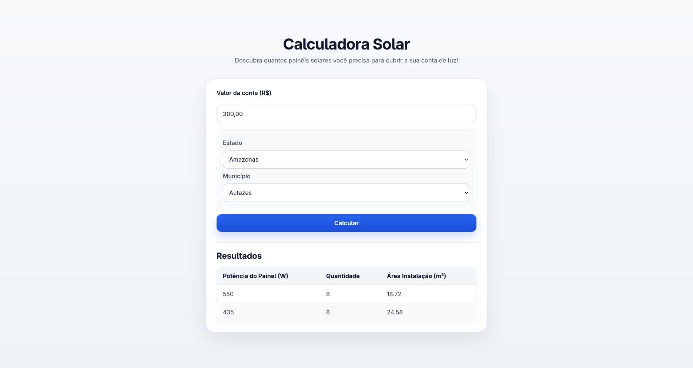

# Calculadora Solar



A Calculadora Solar estima quantos painéis solares são necessários para uma instalação residencial, com base no consumo de energia e no município informado.

O projeto consulta APIs públicas para obter dados atualizados sobre:

- tarifas de energia;
- distribuidoras que atendem cada município;
- irradiação solar da região.

## Funcionalidades

- cálculo da quantidade de painéis necessários;
- estimativa da potência dos painéis;
- cálculo da área aproximada para instalação;
- seleção de estado e município;
- uso de dados atualizados por meio de APIs.

## Tecnologias

- HTML5
- CSS
- JavaScript
- Node.js
- Express.js

## Como o projeto funciona

A calculadora usa duas informações principais:

- valor da conta de luz em reais;
- município brasileiro onde a instalação será feita.

Com isso, o sistema identifica a distribuidora local, consulta a tarifa aplicável, obtém as coordenadas do município e busca a irradiação solar média da região. A partir desses dados, calcula a quantidade de painéis e a área necessária para a instalação.

## Como testar o projeto

### 1. Clonar o repositório

Clone o projeto para a sua máquina e entre na pasta criada:

```bash
git clone <URL_DO_REPOSITORIO>
cd <PASTA_DO_PROJETO>
```

### 2. Verificar se o pnpm está instalado

Confira se o `pnpm` já está disponível no seu computador:

```bash
pnpm --version
```

Se o comando não funcionar, consulte a documentação oficial de instalação em português:

[Instalação do pnpm](https://pnpm.io/pt/installation)

### 3. Instalar as dependências

Com o `pnpm` instalado, baixe as dependências do projeto:

```bash
pnpm install
```

### 4. Iniciar o servidor

Depois de instalar as dependências, execute o projeto com:

```bash
node server/index.js
```

Na primeira execução, o carregamento pode levar alguns minutos.

### 5. Abrir no navegador

Acesse o projeto no navegador:

```bash
http://localhost:3000
```


## Dados e APIs utilizadas

- [Tarifas de aplicação das distribuidoras de energia elétrica](https://dadosabertos.aneel.gov.br/dataset/tarifas-distribuidoras-energia-eletrica)
- [Base de Dados Geográfica da Distribuidora - BDGD](https://dadosabertos.aneel.gov.br/dataset/base-de-dados-geografica-da-distribuidora-bdgd)
- [API de localidades do IBGE](https://servicodados.ibge.gov.br/api/docs/localidades)
- [Geodata BR - Brasil (Coordenadas dos Municípios)](https://github.com/tbrugz/geodata-br)
- [NASA POWER API](https://power.larc.nasa.gov/docs/services/api/)

## Créditos

- [Pedro Augusto](https://github.com/thatpedroaugusto)
- [Carlo Príncipe](https://github.com/carlocp1)
